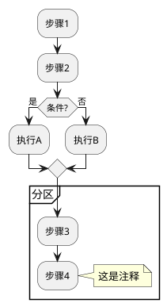

# EcoGo CI/CD 流程图集合

本目录包含 EcoGo CI/CD Pipeline 的详细流程图，使用 PlantUML 格式编写。

## 📁 文件列表

### 1. `cicd-detailed-flow.puml` - 详细流程图
**最全面的流程图**，展示完整的 CI/CD 流程。

**包含内容：**
- 所有 11 个阶段的详细步骤
- Feature/Develop 和 Main 分支的分支逻辑
- 每个阶段的工具、执行内容和注释
- 判断条件和决策点
- MongoDB 服务的启动和使用
- AWS 配置检查逻辑
- 本地测试 vs 真实环境测试的区别

**适用场景：** 
- 理解完整流程
- 新成员培训
- 流程文档

---

### 2. `cicd-tools-architecture.puml` - 工具架构图
**工具和组件关系图**，展示各个工具之间的依赖和数据流。

**包含内容：**
- 所有使用的工具和服务
- 工具之间的连接关系
- 输入和输出产物
- AWS 云服务架构
- Artifacts 存储结构

**适用场景：**
- 了解技术栈
- 工具选型参考
- 架构设计

---

### 3. `cicd-branch-comparison.puml` - 分支对比图
**分支执行对比**，清晰展示不同分支的执行差异。

**包含内容：**
- 共同流程（Stage 1-6）
- Feature/Develop 分支专属流程
- Main 分支专属流程
- 每个阶段的耗时估算
- 总执行时间对比
- 失败影响说明

**适用场景：**
- 理解分支策略
- 优化执行时间
- 问题排查

---

### 4. `cicd-sequence-diagram.puml` - 时序图
**时序交互图**，展示各组件之间的时间顺序和交互。

**包含内容：**
- 开发者到 GitHub 的交互
- GitHub Actions 与各工具的调用
- 数据库服务的生命周期
- AWS 部署过程
- Artifacts 上传时机
- 完整的执行顺序

**适用场景：**
- 理解执行顺序
- 调试流程问题
- 性能优化

---

### 5. `cicd-decision-flow.puml` - 决策流程图
**决策点详解**，展示所有关键决策和分支逻辑。

**包含内容：**
- 分支类型判断
- AWS 凭证检查
- 手动批准等待
- URL 配置检查
- 服务启动成功判断
- 测试通过/失败处理
- 错误处理策略

**适用场景：**
- 理解条件判断
- 配置问题排查
- 流程定制

---

### 6. `cicd-data-flow.puml` - 数据流和产物图
**数据流向图**，展示从源码到最终产物的完整数据流。

**包含内容：**
- 源代码输入
- 各阶段产生的中间产物
- 最终生成的报告
- GitHub Artifacts 结构
- GitHub Security 集成
- 通知机制

**适用场景：**
- 追踪产物来源
- 理解报告类型
- 数据流分析

---

## 🎨 如何查看这些图

### 方法 1: 在线查看（推荐）

#### PlantUML Online Editor
1. 访问 http://www.plantuml.com/plantuml/uml/
2. 复制 `.puml` 文件内容
3. 粘贴到编辑器
4. 自动生成图形
5. 可导出为 PNG/SVG

#### PlantText
1. 访问 https://www.planttext.com/
2. 复制粘贴代码
3. 点击 "Refresh" 生成图形

---

### 方法 2: VS Code 本地查看

#### 安装插件
```
名称: PlantUML
ID: jebbs.plantuml
```

#### 使用步骤
1. 安装 PlantUML 插件
2. 安装 Java（PlantUML 依赖）
3. 打开 `.puml` 文件
4. 按 `Alt + D` 预览图形
5. 右键 → "Export Current Diagram" 导出

---

### 方法 3: IntelliJ IDEA

#### 安装插件
```
Settings → Plugins → 搜索 "PlantUML integration"
```

#### 使用步骤
1. 安装插件
2. 打开 `.puml` 文件
3. 点击右侧预览窗口
4. 右键导出图片

---

### 方法 4: 命令行生成

#### 安装 PlantUML
```bash
# macOS
brew install plantuml

# Ubuntu/Debian
apt-get install plantuml

# Windows
choco install plantuml

# 或者下载 JAR
wget https://sourceforge.net/projects/plantuml/files/plantuml.jar/download
```

#### 生成图片
```bash
# 生成 PNG
plantuml cicd-detailed-flow.puml

# 生成 SVG（矢量图，推荐）
plantuml -tsvg cicd-detailed-flow.puml

# 批量生成
plantuml *.puml

# 使用 JAR
java -jar plantuml.jar cicd-detailed-flow.puml
```

---

## 📖 推荐阅读顺序

### 对于新手：
1. **cicd-branch-comparison.puml** - 先了解分支差异
2. **cicd-detailed-flow.puml** - 学习完整流程
3. **cicd-tools-architecture.puml** - 认识工具栈
4. **CICD-PIPELINE-GUIDE.md** - 阅读详细文档

### 对于开发者：
1. **cicd-decision-flow.puml** - 理解决策逻辑
2. **cicd-sequence-diagram.puml** - 了解执行顺序
3. **cicd-data-flow.puml** - 追踪数据和产物

### 对于运维人员：
1. **cicd-tools-architecture.puml** - 了解架构
2. **cicd-detailed-flow.puml** - 掌握部署流程
3. **cicd-data-flow.puml** - 管理产物和监控

---

## 🎯 图表对比

| 图表 | 视角 | 详细程度 | 适合人群 |
|-----|------|---------|---------|
| detailed-flow | 流程 | ⭐⭐⭐⭐⭐ | 所有人 |
| tools-architecture | 架构 | ⭐⭐⭐ | 技术人员 |
| branch-comparison | 对比 | ⭐⭐⭐⭐ | 开发者 |
| sequence-diagram | 时序 | ⭐⭐⭐⭐ | 开发/测试 |
| decision-flow | 逻辑 | ⭐⭐⭐⭐ | 开发/运维 |
| data-flow | 数据 | ⭐⭐⭐ | 架构师 |

---

## 🔧 自定义和修改

### 修改图表
1. 编辑 `.puml` 文件
2. 使用 PlantUML 语法
3. 预览查看效果
4. 导出新图片

### PlantUML 基础语法


### 常用元素
- `:文本;` - 活动/步骤
- `if (条件?)` - 判断
- `partition "名称"` - 分区
- `fork` / `end fork` - 并行
- `note right/left` - 注释
- `|分类|` - 泳道

---

## 📚 相关文档

- **CICD-PIPELINE-GUIDE.md** - 完整的文字版流程指南
- **CICD-FIXES.md** - CI/CD 修复记录
- **TERRAFORM-SETUP.md** - Terraform 配置指南
- **PERFORMANCE-TESTING.md** - 性能测试指南
- **.github/SECRETS-TEMPLATE.md** - Secrets 配置模板

---

## 🤝 贡献

如果您发现图表有误或需要改进：

1. 修改对应的 `.puml` 文件
2. 确保语法正确（本地预览）
3. 更新本 README（如有新图）
4. 提交 Pull Request

---

## 💡 常见问题

### Q: 图表显示不完整？
**A**: 某些在线工具有大小限制，建议使用本地工具或命令行生成。

### Q: 中文显示乱码？
**A**: 确保文件使用 UTF-8 编码，并安装中文字体。

### Q: 生成速度慢？
**A**: 复杂图表生成需要时间，请耐心等待或使用 SVG 格式。

### Q: 如何导出高清图？
**A**: 
```bash
# 使用 SVG 格式（矢量图）
plantuml -tsvg *.puml

# 或高 DPI PNG
plantuml -DPLANTUML_LIMIT_SIZE=8192 *.puml
```

---

## 📄 许可证

这些图表是 EcoGo 项目的一部分，遵循项目相同的许可证。

---

**文档版本**: 1.0  
**最后更新**: 2026-01-28  
**维护者**: EcoGo Team
